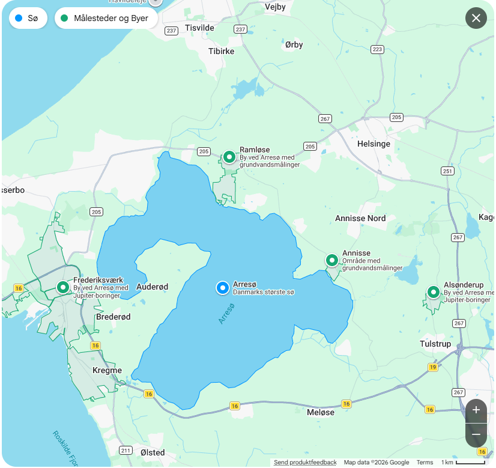
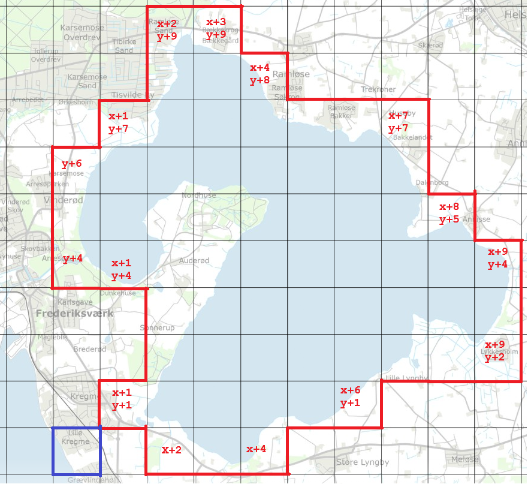

# Arresø
Min legeplads til at bringe min sø-modelleringsviden up-to-date


Googles bud på en bounding_box er ikke god nok 
- Brug datafordeleren til at hente sø-geometri
-- DS_Stednavn 
--- Søg på skrivemaade og gem navngivetSted_objectid
-- DS_Soe 
--- Søg på objectid og hent geometri ETRS89 / UTM zone 32N (EPSG:25832)
-- GEODKV_Soe
--- Geometri i 3D https://geodanmark.nu/Spec6/HTML5/DK/StartHer.htm


- Brug geojson-formatet i projektionen WGS 84 (EPSG:4326) og få kortvisning i github 
-- Baggrundskort kan ikke fjernes
-- Farver kan ikke tilpasses

```
#Pseudo

#1. Gem geometri i fil

library(sf)

df_temp <- readLines("datafordeler_geometri.json")
v_temp <- unlist(strsplit(df_temp, split=","))
df_temp <- data.frame(line = v_temp)

df_temp$line[1]
df_temp$line[1] <- sub("MULTIPOLYGON","",df_temp$line[1])

index_max <- nrow(df_temp)

df_temp$line[1] <- sub("(((","",df_temp$line[1], fixed=TRUE)
df_temp$line[index_max] <- sub(")))","",df_temp$line[index_max], fixed=TRUE)

df_temp$line <- sub("^ ","",df_temp$line)

df_temp$E <- NA
df_temp$N <- NA

for (i in 1:nrow(df_temp)){
  index     <- i
  temp_line <- df_temp$line[i]
  v_temp    <- unlist(strsplit(temp_line, split=" "))
  df_temp$E[index] <- v_temp[1]
  df_temp$N[index] <- v_temp[2]
}

df_sf <- st_as_sf(df_temp, coords = c("E", "N"), crs = 25832)

# Transformer til WGS84
df_wgs84 <- st_transform(df_sf, crs = 4326)

polygon_sf <- df_wgs84$geometry %>%
  st_combine() %>%          # Samler punkterne til et MULTIPOINT
  st_cast("LINESTRING") %>% # Laver punkterne om til en linje
  st_cast("POLYGON")        # Lukker linjen og laver den til et polygon


st_write(polygon_sf, "github_delvisklar_geometri.geojson", driver = "GeoJSON", delete_dsn = TRUE)
```

- Bestem kvadrater i DKN 



Inspiration 
https://sgavmst.dk/media/kxspz2ao/dokumentation-for-digitalt-skovkort.pdf